# KOVA

<p align="center">
  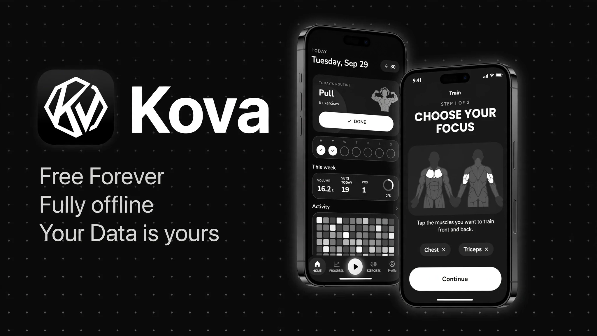
</p>

<p align="center">
  <strong>A strength log built for the gym floor.</strong><br>
  No accounts. No ads. No tracking. No internet required.
</p>

---

KOVA is a **free strength training app for Android** built around one idea:

> **Your workout data should belong to you.**

Log your training, track your progress, build routines, and understand your strength without handing your workout history to a server.

KOVA is built with Flutter and is closed source. Android 7.0+ ships today, with iOS 15+ and Wear OS 3+ in development.

---

## Training

**Tap a muscle. Start training.**

Choose your focus from an interactive front-and-back body map. KOVA builds a session around it, then lets you adjust everything set by set.

* Reps, weight, RPE and RIR
* Warm-up, working, drop and failure sets
* Supersets
* Previous-set performance while training
* Plate calculation based on your available plates
* Rest timer with custom alarm sounds
* Rest alarms that work with the screen off
* Sessions that survive a device reboot
* Routines that can be grouped, reordered and scheduled
* Equipment-aware training through **Places**

Whether you're training at home, in a gym, or outside, KOVA only suggests exercises that match the equipment you actually have.

---

## Track Progress

**Your progress comes from your training, not vanity metrics.**

KOVA turns your logged sets into useful feedback:

* Training volume
* Weekly goals
* Training streaks
* Personal records
* GitHub-style activity heatmap
* Strength curves
* Estimated 1RM
* 30-day muscle distribution
* Bodyweight tracking
* 10 body measurements
* Progress photo timeline
* Muscle-map progress timeline
* Levels and 20 medals
* Shareable progress cards

Prefer not to take progress photos? Your training history can generate a **muscle-map timeline** instead.

---

## 500+ Exercises

A built-in exercise library with:

* 500+ exercises
* Animations
* Step-by-step instructions
* Muscle filters
* Equipment filters
* Difficulty filters
* Search
* Favourites
* Custom exercises
* Custom exercise photos, GIFs and videos

You can also keep a **training journal** with notes, photos and videos organized on a calendar.

---

## Built-in Tools

KOVA includes tools for the boring math humans apparently refuse to do themselves:

* 1RM calculator
* Plate calculator
* BMI calculator
* Calorie & macro calculator
* Body-fat calculator
* Warm-up calculator
* 5 home-screen widgets

---

## Your Data. Your Phone.

KOVA is designed to keep your data under your control.

### Import

Import your training history from:

* Hevy
* Strong
* Lyfta
* FitNotes
* openGym
* CSV

### Export

Export your data as:

* CSV
* Full ZIP backups
* Uploaded media included in backups

Backups can be imported back into KOVA.

You can also delete everything from the app with a single action.

---

## Privacy by Design

**KOVA does not need the internet to work.**

There are:

* No analytics SDKs
* No advertising SDKs
* No accounts
* No cloud requirement
* No tracking
* No network code

KOVA does **not request Android's `INTERNET` permission**.

Your training data stays on your device. There is no built-in mechanism for workout data to be uploaded to a remote server.

The ten permissions KOVA does request are all local, and nine of them exist so the rest timer and the live session behave correctly. The full list, with the reason for each, is on the privacy section of the project website.

---

## Screens

|                                                                                                                                         |                                                                                                            |                                                                                                                                        |
| --------------------------------------------------------------------------------------------------------------------------------------- | ---------------------------------------------------------------------------------------------------------- | -------------------------------------------------------------------------------------------------------------------------------------- |
| 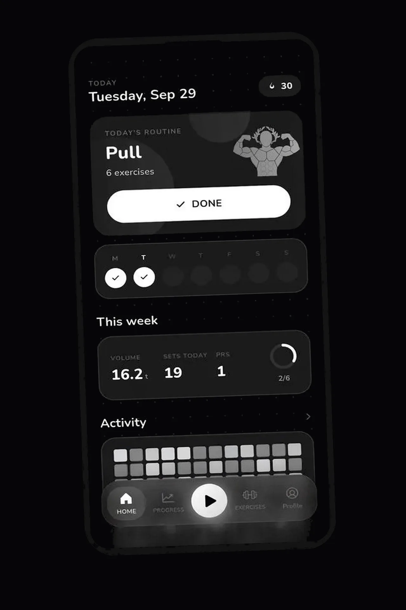 | 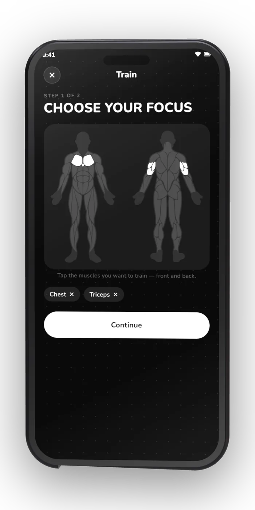             | 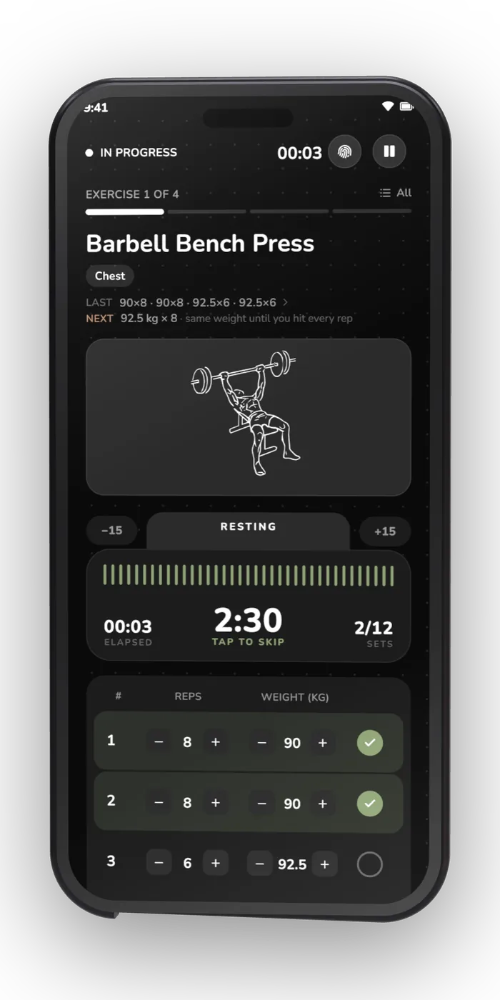 |
| **Today**                                                                                                                               | **Body Map**                                                                                               | **Live Session**                                                                                                                       |
| 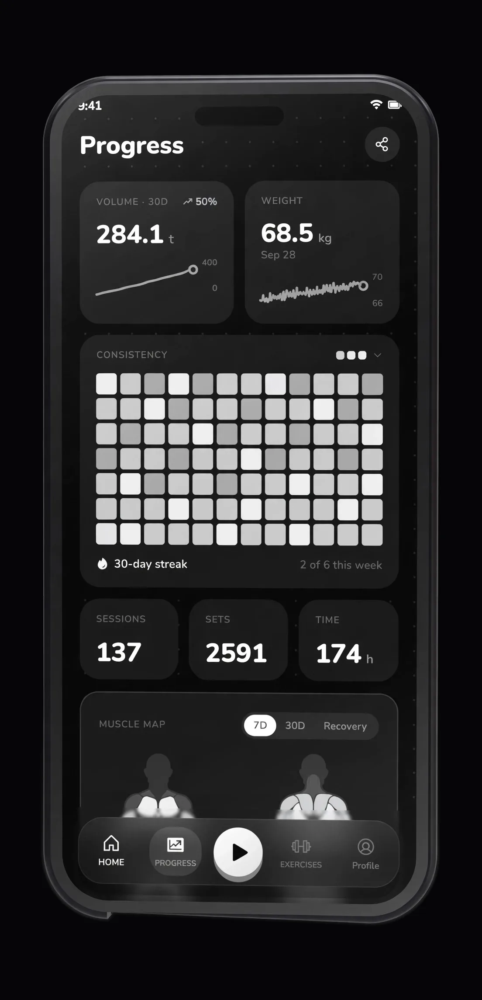        | 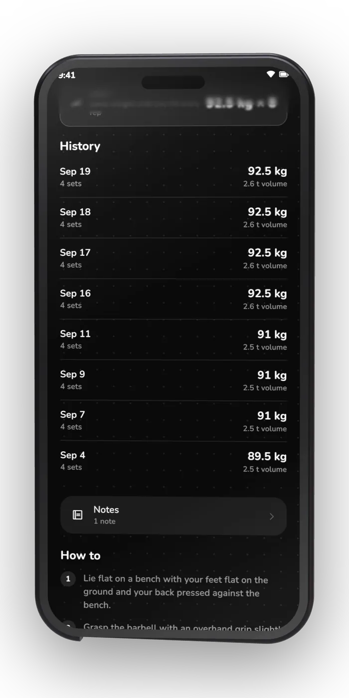                              | 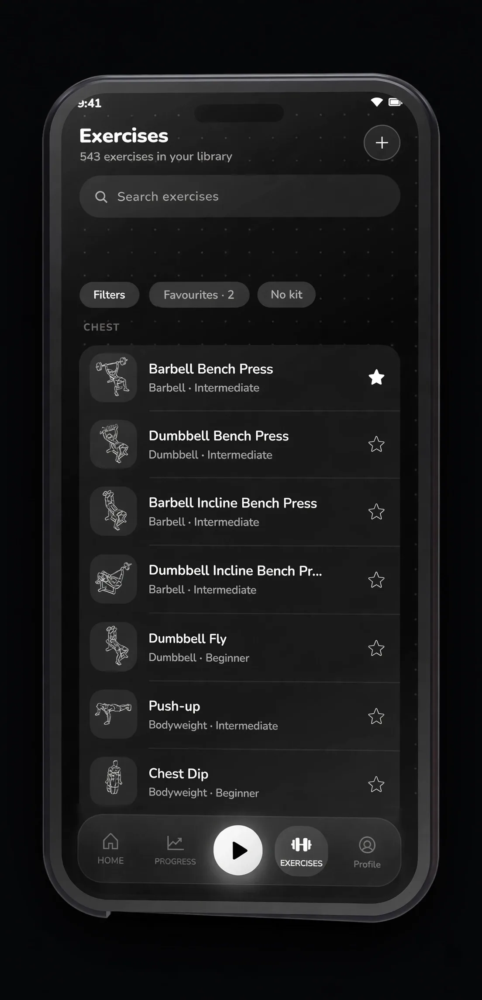                                  |
| **Progress**                                                                                                                            | **History**                                                                                                | **Exercise Library**                                                                                                                   |
| 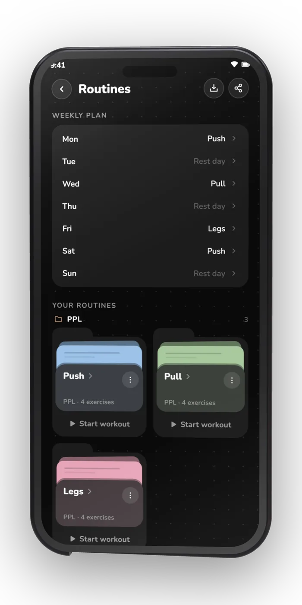                               | 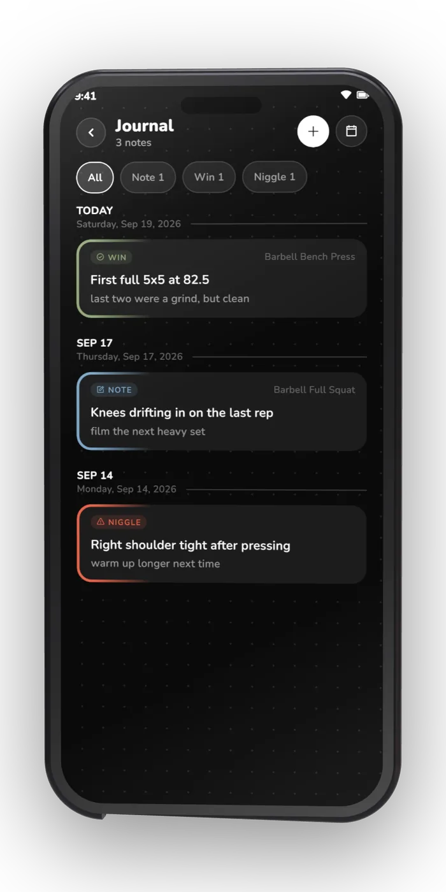   | 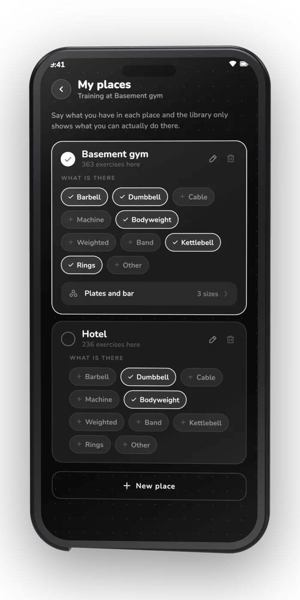                         |
| **Routines**                                                                                                                            | **Journal**                                                                                                | **Places**                                                                                                                             |
| 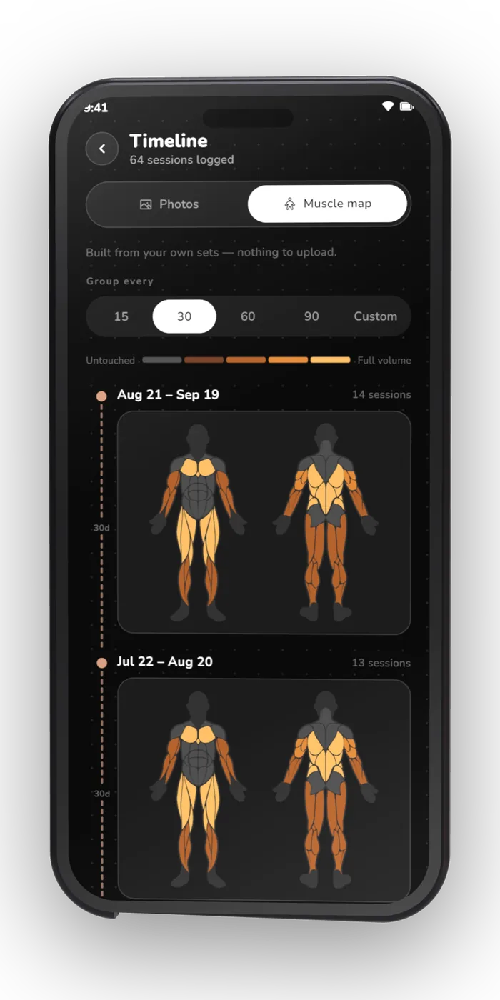                                                  | 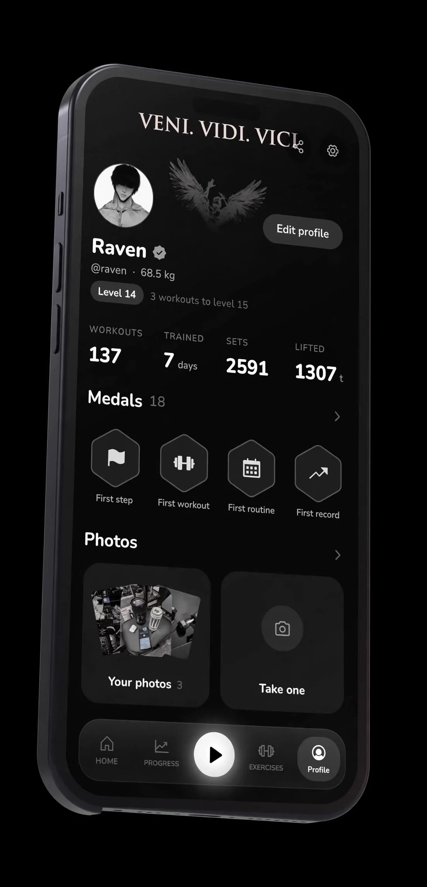 | 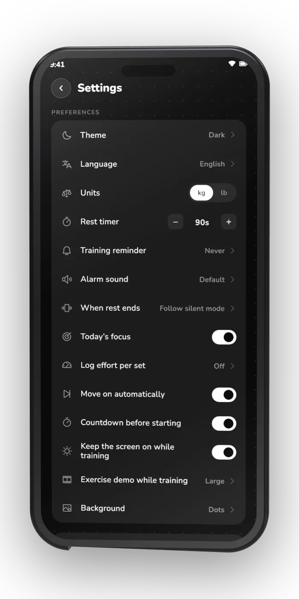          |
| **Muscle Timeline**                                                                                                                     | **Profile**                                                                                                | **Settings**                                                                                                                           |

---

## Install

<p align="center">
  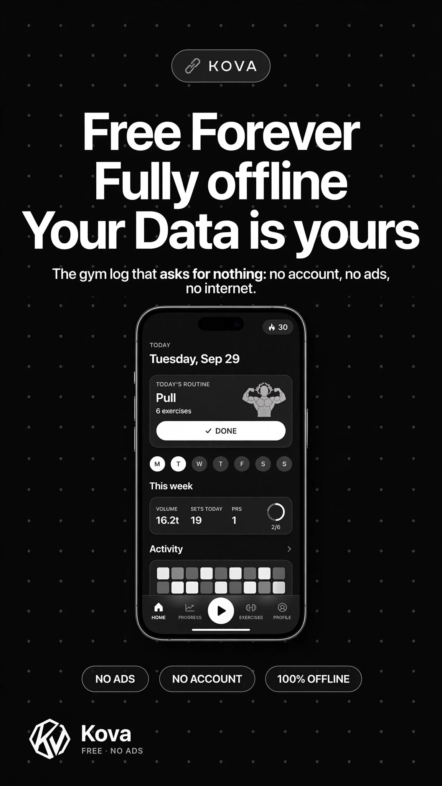
  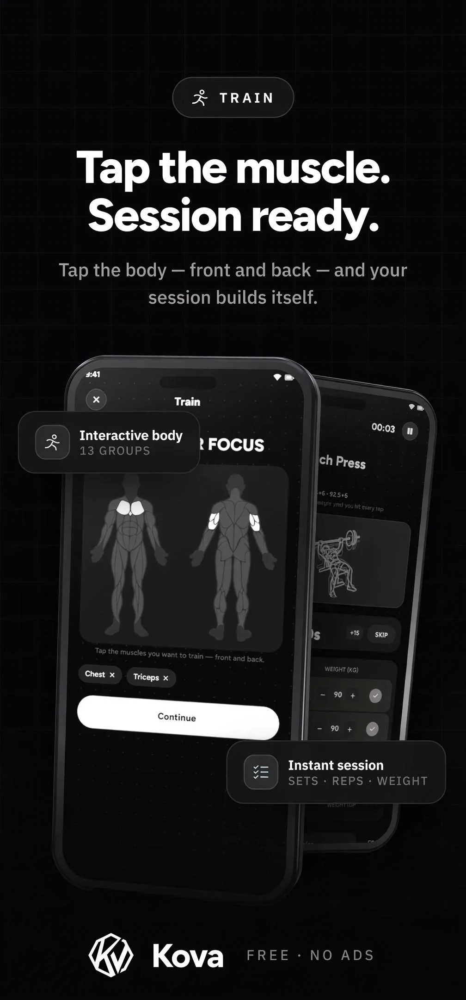
  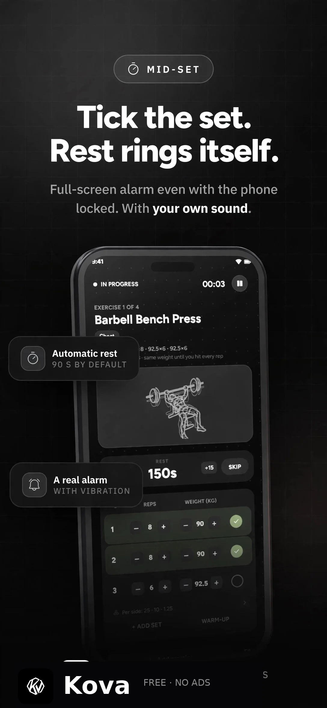
</p>

<p align="center">
  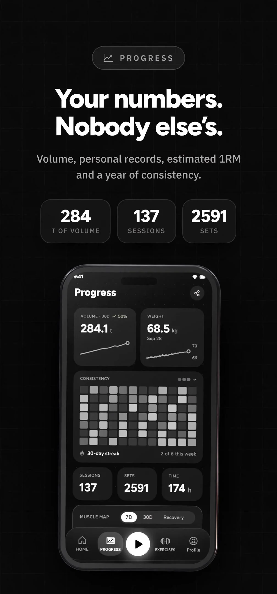
  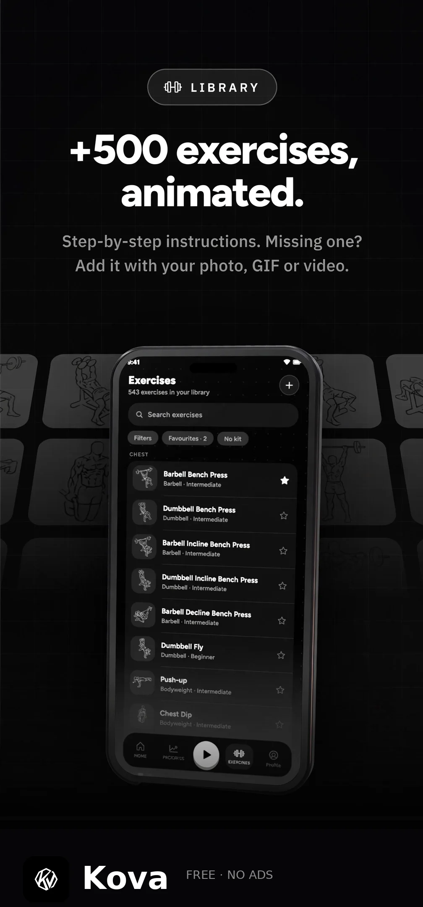
  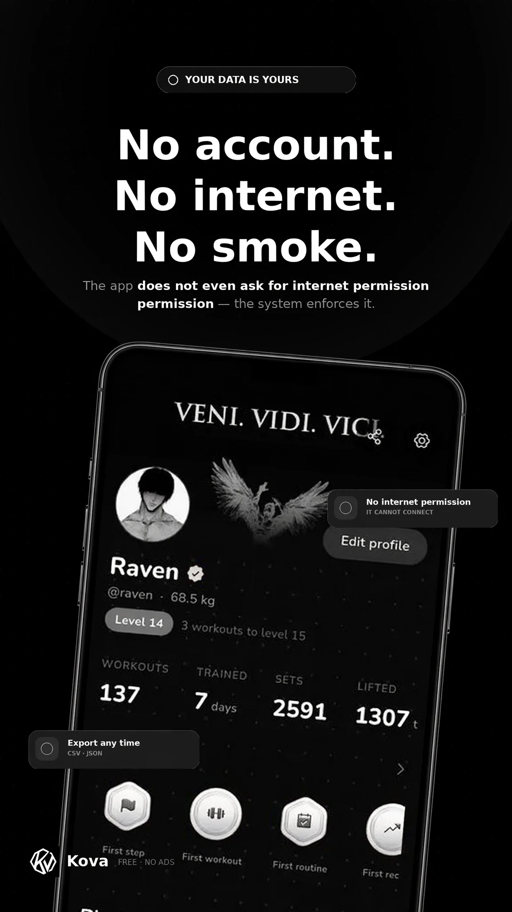
</p>

### Android

**Android 7.0+**

* **GitHub Releases:** https://github.com/ravvdevv/kova-app/releases

### Coming

* iOS 15+
* Wear OS 3+

There is no desktop build, and none is planned.

---

## Working on this site

```
node dev-server.cjs          # http://localhost:8080
node tests/check-claims.cjs  # verify the site's numbers against the screenshots
```

Both run on a bare Node install. No dependencies, no build step.

`dev-server.cjs` exists because Vercel resolves `/hevy-alternative` to
`hevy-alternative.html` (`cleanUrls` in `vercel.json`) and a plain static server
does not, which makes every internal link 404 in local preview while working
fine in production.

`tests/check-claims.cjs` fails when the site states a number the screenshots
contradict. Every number that shipped wrong on this page looked correct in the
markup and was only wrong relative to the phone image printed beside it, so a
reviewer reading HTML could not see it. The values it checks live in
`tests/facts.json` with the screenshot each came from; update both when you
re-capture a screen.

### Known app bug

`assets/screens/02-progress.webp` shows the label **"2 of 6 this week"** next to a
heatmap where all 84 cells are lit, including all 7 in the final week. The app is
miscounting the week. It is baked into the Flutter UI, so it cannot be fixed from
this repository, and the site itself states no competing figure. Fix it in the app
and re-capture the screenshot.

---

## Technical

KOVA is built with **Flutter**.

**Package:** `com.kova.app`

**Supported languages:** 16

**Units:** kg / lb

**Themes:** Light / Dark

---

## Credits

Special thanks to **InlitX**.

Exercise illustrations are provided by [Workout Guide](https://github.com/bryllim/workout-guide) by Bryl Lim, based on [Everkinetic](https://github.com/everkinetic/data), and are licensed under **CC BY-SA 4.0**.

KOVA uses **Nunito**, licensed under the [SIL Open Font License](assets/fonts/Nunito-OFL.txt).

---

## License

KOVA is closed source and free to use. It is not open source, and no source code is published.

The bundled artwork and fonts keep their own licences, listed under Credits above.
